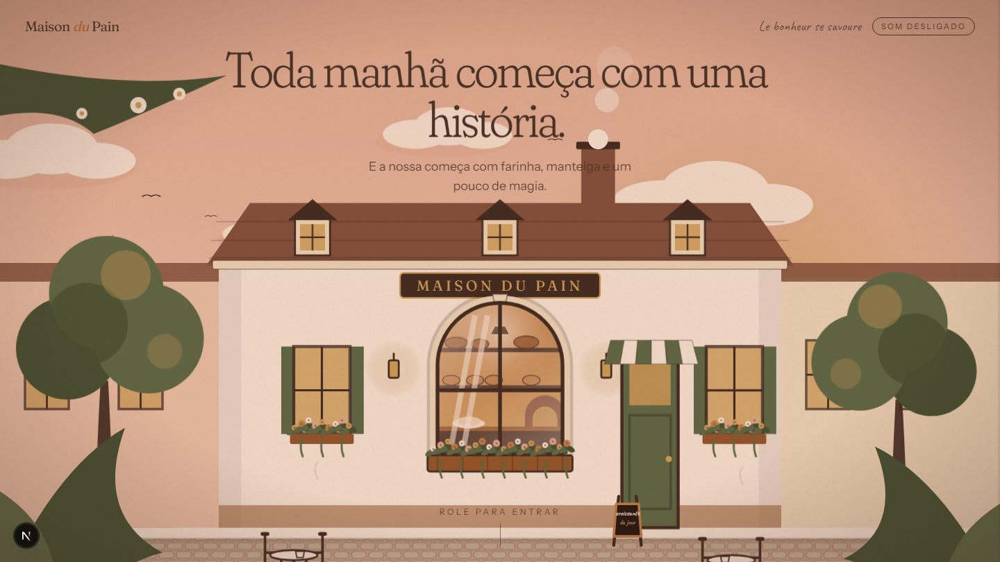

<div align="center">

# 🥐 MAISON DU PAIN

**Le bonheur se savoure.**

*An immersive journey through the art of French baking.*
*Where handcrafted tradition meets creative technology.*

[Demonstração publicada: _em breve_] · [GIF da experiência: _em breve_]

</div>



## Apresentação

Maison du Pain é uma padaria artesanal francesa **fictícia** e, ao mesmo tempo, um projeto de portfólio de *creative development*: um site de scrollytelling em que o visitante controla a história rolando a página. A câmera atravessa uma janela, uma massa vira um croissant em 3D, seis produtos respondem ao ponteiro e a noite cai sobre a rua.

Não existe endereço, telefone, preço ou pedido reais. Onde um recurso comercial apareceria, há uma demonstração claramente identificada.

## Conceito criativo

Um livro ilustrado que ganha profundidade. A narrativa é guiada pela **luz**: amanhecer rosado → interior âmbar → fim de tarde dourado. Tudo é ilustração própria em SVG em camadas, com um único objeto "real" (o croissant em WebGL) para dar peso à transformação central.

| Cena | O que acontece | Técnica principal |
| --- | --- | --- |
| Loader | Um forno esquenta conforme os recursos carregam; a porta abre e a câmera atravessa o vapor | Progresso real + GSAP |
| 01 · Despertar | Fachada ao amanhecer; a câmera avança e atravessa a janela | Dolly exponencial em 8 camadas SVG |
| 02 · Interior | Farinha cai, ingredientes se aproximam, a padeira sova (braços ligados ao scroll) e a massa cresce | Função pura progresso → quadro |
| 03 · Croissant | A massa vira um croissant 3D que gira e abre as camadas em leque | React Three Fiber, geometria procedural |
| 04 · Sabores | Seis produtos em composição editorial, cada um com interação própria | Variáveis CSS + ScrollTrigger |
| 05 · Processo | Trigo → grão → farinha → massa → fermentação → forno → pão | Uma única timeline, partículas SVG |
| 06 · Retorno | A câmera recua até a rua ao entardecer; três ações reais | Reuso da câmera da Cena 01 |

## Demonstração visual

| Loader | Interior | Croissant |
| --- | --- | --- |
|  |  |  |

| Sabores | Processo | Retorno |
| --- | --- | --- |
|  |  |  |

Todas as imagens acima são capturas reais geradas pelos testes Playwright. Um GIF da experiência ainda não foi gravado.

## Tecnologias

- **Next.js 16** (App Router), **React 19**, **TypeScript** estrito, **Tailwind CSS 4**
- **GSAP + ScrollTrigger** (pin, scrub) e **Lenis** (scroll suave, sincronizado com o ticker do GSAP)
- **Three.js + React Three Fiber** (somente na Cena 03, carregado sob demanda)
- **Playwright** (testes de fluxo e capturas), ESLint, `tsc`
- Fontes: Fraunces, Instrument Sans e Caveat via `next/font`

Não usados, de propósito: Rive e Spline (sem integração verificada; SVG + GSAP resolve), Drei, Framer Motion/Motion e KTX2/Draco (não há modelos nem texturas externas para comprimir).

## Funcionalidades implementadas

- Loader cinematográfico com **progresso real** (fontes, `load` e imagens críticas), tratamento de falha/timeout, versão simplificada para dispositivos fracos, botão "Pular introdução".
- Seis cenas controladas pelo scroll, **reversíveis**: cada cena é uma função pura do progresso, então rolar rápido, voltar ou redimensionar sempre reproduz o mesmo quadro.
- Croissant 3D procedural (sem arquivo GLB): cristas em barril, texturas geradas em canvas, partículas de farinha, leque com corte em espiral.
- Seis produtos interativos que funcionam por ponteiro, toque e **teclado** (cada um é um slider acessível), com painel de detalhes em `<dialog>` nativo.
- Cursor em anel, botões magnéticos, paralaxe por ponteiro, indicador de progresso, cabeçalho que se adapta a fundos escuros.
- Efeitos sonoros opcionais, sintetizados em código, **desligados por padrão** (o áudio só é inicializado quando o usuário liga).
- Suporte a `prefers-reduced-motion`: sem pins, sem Lenis, sem cursor/magnetismo, versão estática de cada cena.
- Ações finais reais e honestas: cardápio, dados de visita ("A definir") com compartilhamento, e um pedido de **demonstração** que gera um resumo copiável sem enviar nada.

## Arquitetura

```
src/
├── app/                     layout (fontes, metadados) e página
├── components/
│   ├── animations/          ScrollProvider (Lenis ↔ GSAP), SoundProvider
│   ├── layout/              Experience (montagem), Header, Footer
│   ├── scenes/              uma pasta por cena (camera.ts = função pura)
│   └── ui/                  Loader, Dialog, Cursor, MagneticButton…
├── config/                  constantes de cada cena, produtos, contato
├── hooks/                   useScrubbedScene, useMagnetic, useDeviceTier…
├── lib/                     gsap (registro), math
└── styles/globals.css       tokens de cor/fonte e animações ambientais
tests/                       Playwright
docs/                        ARCHITECTURE.md, DECISIONS.md, screenshots
```

Detalhes, padrões e guias para adicionar cenas e produtos em [`docs/ARCHITECTURE.md`](docs/ARCHITECTURE.md). Estado do projeto e decisões em [`docs/DECISIONS.md`](docs/DECISIONS.md).

## Instalação

Requisitos: Node.js 20 ou superior.

```bash
npm install
```

## Execução

```bash
npm run dev      # http://localhost:3000
npm run build    # build de produção
npm run start    # serve o build
```

No Windows, o arquivo `Iniciar.bat` instala as dependências (se faltarem), sobe o servidor e abre o navegador.

## Testes

```bash
npm run typecheck
npm run lint
npx playwright install chromium   # uma vez
npm test                          # 11 testes; salva capturas em test-results/shots
```

Os testes cobrem: loader, scroll progressivo/reverso/rápido da Cena 01, sova sincronizada da Cena 02, croissant 3D, interações e diálogos dos seis produtos, layout mobile (390 px) sem rolagem horizontal, o percurso completo da Cena 05, as três ações finais, movimento reduzido, som desligado por padrão e landmarks/títulos.

Limitações conhecidas dos testes: rodam em Chromium sobre WebGL por software (lento) e emulam o celular só por viewport; não há testes em dispositivos reais, Safari ou Firefox.

## Performance

Medidas e técnicas **implementadas**: WebGL carregado só perto da Cena 03 e pausado fora da tela; DPR limitado a 1,5 (1 em dispositivos fracos); animações guiadas por transformações (atributos SVG e `transform`), sem re-render do React durante o scroll; limpeza de timelines, ScrollTriggers e recursos WebGL; versão simplificada por *device tier*.

**Ainda não medido:** FPS, Lighthouse, uso de memória e consumo em dispositivos móveis reais. Não há números a reportar.

## Roadmap / pendências

- Composição mobile real da Cena 01 (o viewBox em retrato corta árvores e mesas) e testes em celulares.
- Transições cinematográficas contínuas entre algumas cenas (hoje usam uma troca de cor).
- Ilustração 2D do croissant na Cena 04 e quadro final da Cena 05 mais ricos.
- Medições de performance e auditoria de contraste automatizada.
- Gravar o GIF e publicar a demonstração.

## Créditos e licenças

- Código e ilustrações: originais deste repositório, sob licença [MIT](LICENSE). Nenhum asset de terceiros além das fontes.
- Fontes **Fraunces**, **Instrument Sans** e **Caveat**: SIL Open Font License (Google Fonts).
- Bibliotecas: Next.js, React, Tailwind CSS, Three.js, React Three Fiber, Lenis e Playwright sob MIT/Apache; **GSAP** segue a [licença própria da GreenSock](https://gsap.com/standard-license), que deve ser conferida antes de uso comercial.
- Marca "Maison du Pain", personagens e produtos: fictícios, sem relação com empresas reais.
