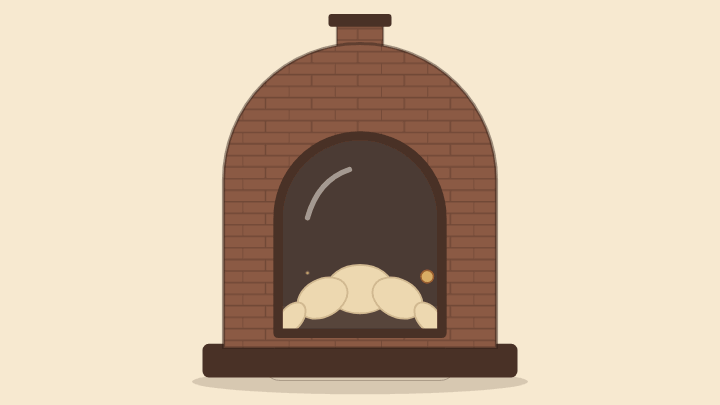
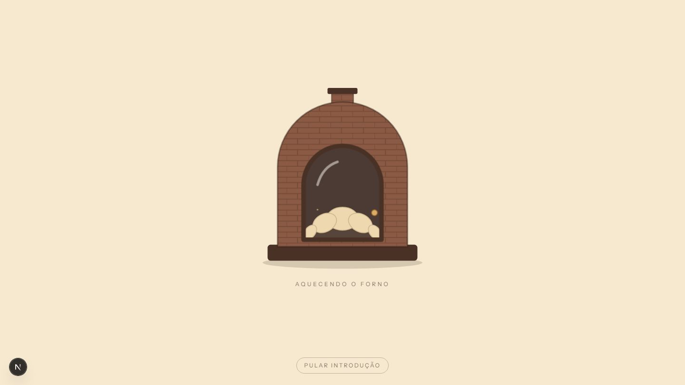
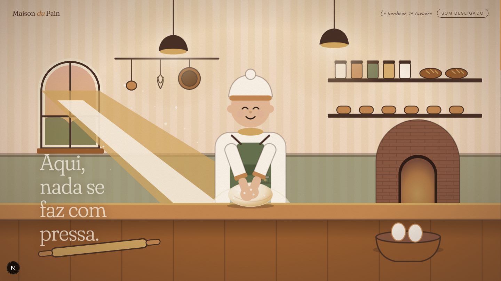
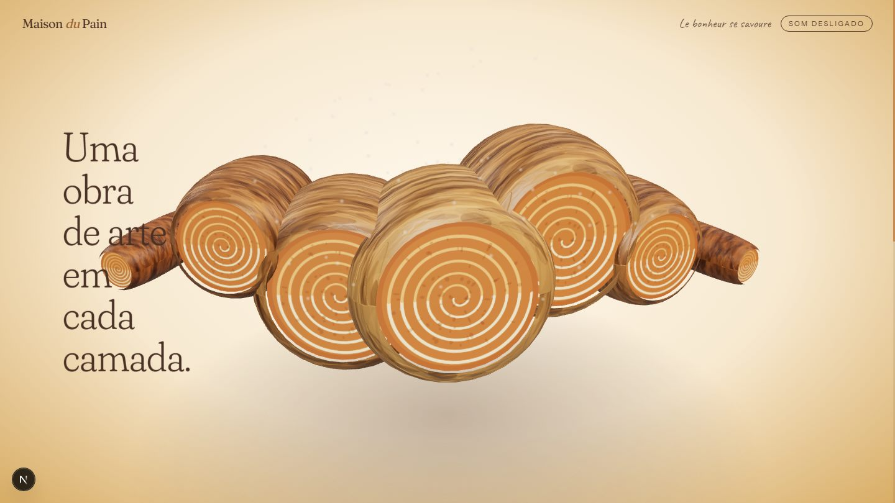
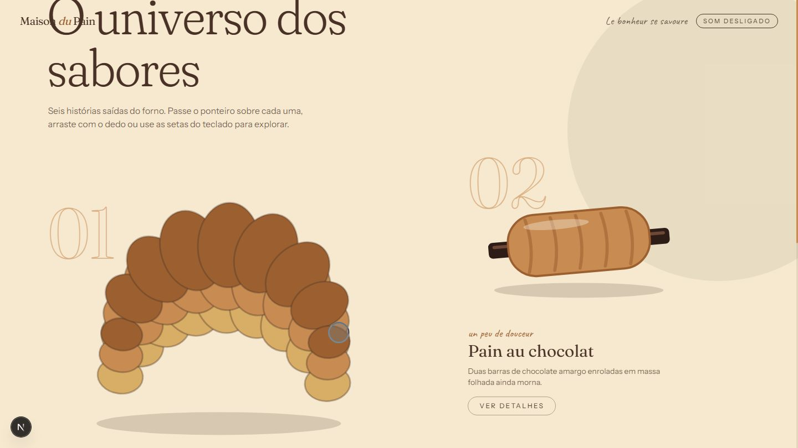
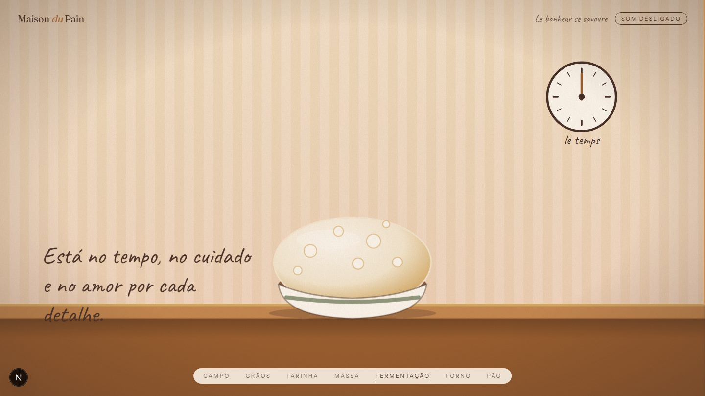
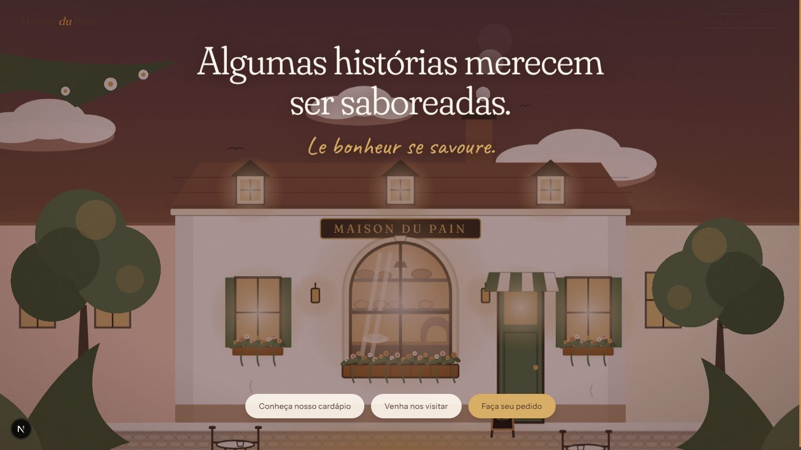
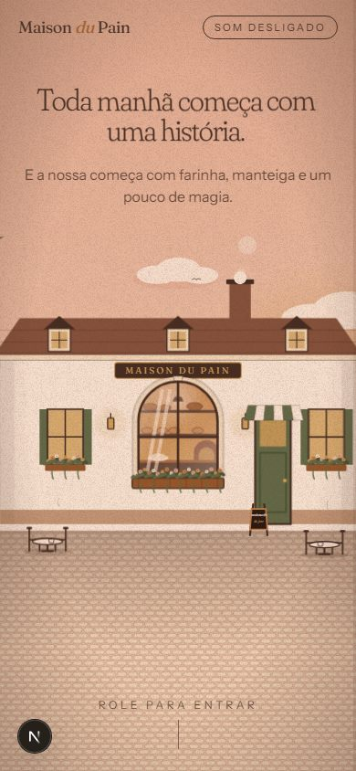
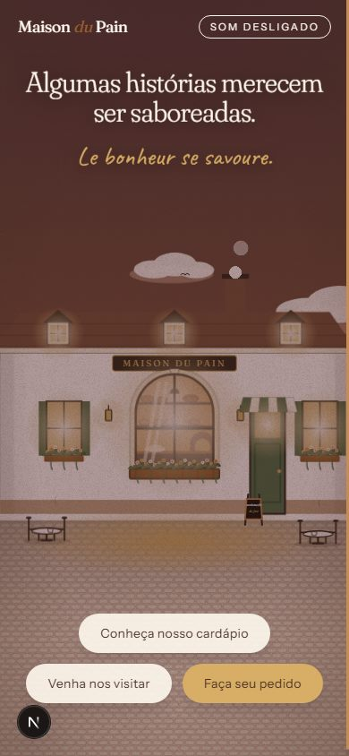

<div align="center">

# 🥐 MAISON DU PAIN

**Le bonheur se savoure.**

*An immersive journey through the art of French baking.*
*Where handcrafted tradition meets creative technology.*

**[Ver a demonstração online](https://maison-du-pain-two.vercel.app)**

</div>



*Gravação real do site em produção local (720×405): o loader, as seis cenas guiadas pelo scroll, a interação com o croissant e a baguete e o pedido de demonstração. Os quadros foram capturados em passos de scroll, então o ritmo é ilustrativo, não a fluidez real.*

## Apresentação

Maison du Pain é uma padaria artesanal francesa **fictícia** e, ao mesmo tempo, um projeto de portfólio de *creative development*: um site de scrollytelling em que o visitante controla a história rolando a página. A câmera atravessa uma janela, uma massa vira um croissant em 3D, seis produtos respondem ao ponteiro e a noite cai sobre a rua.

Não existe endereço, telefone, preço ou pedido reais. Onde um recurso comercial apareceria, há uma demonstração claramente identificada.

## Conceito criativo

Um livro ilustrado que ganha profundidade. A narrativa é guiada pela **luz**: amanhecer rosado → interior âmbar → fim de tarde dourado. Tudo é ilustração própria em SVG em camadas, com um único objeto "real" (o croissant em WebGL) para dar peso à transformação central.

| Cena | O que acontece | Técnica principal |
| --- | --- | --- |
| Loader | Um forno esquenta conforme os recursos carregam; a porta abre e a câmera atravessa o vapor | Progresso real + GSAP |
| 01 · Despertar | Fachada ao amanhecer; a câmera avança e atravessa a janela | Dolly exponencial em 8 camadas SVG |
| 02 · Interior | Farinha cai, ingredientes se aproximam, a padeira sova (braços ligados ao scroll) e a massa cresce | Função pura progresso → quadro |
| 03 · Croissant | A massa vira um croissant 3D que gira e abre as camadas em leque | React Three Fiber, geometria procedural |
| 04 · Sabores | Seis produtos em composição editorial, cada um com interação própria | Variáveis CSS + ScrollTrigger |
| 05 · Processo | Trigo → grão → farinha → massa → fermentação → forno → pão | Uma única timeline, partículas SVG |
| 06 · Retorno | A câmera recua até a rua ao entardecer; três ações reais | Reuso da câmera da Cena 01 |

## Demonstração visual

| Loader | Interior | Croissant |
| --- | --- | --- |
|  |  |  |

| Sabores | Processo | Retorno |
| --- | --- | --- |
|  |  |  |

Em telas verticais (390×844), a fachada aparece inteira:

| Abertura | Retorno |
| --- | --- |
|  |  |

Todas as imagens acima são capturas reais geradas pelos testes Playwright. O GIF acima foi gravado com Playwright (Chromium headless, WebGL por software).

## Tecnologias

- **Next.js 16** (App Router), **React 19**, **TypeScript** estrito, **Tailwind CSS 4**
- **GSAP + ScrollTrigger** (scrub) sobre palcos `position: sticky` (fixação feita pelo navegador, scroll nativo)
- **Three.js + React Three Fiber** (somente na Cena 03, carregado sob demanda)
- **Playwright** (testes de fluxo e capturas), ESLint, `tsc`
- Fontes: Fraunces, Instrument Sans e Caveat via `next/font`

Não usados, de propósito: Rive e Spline (sem integração verificada; SVG + GSAP resolve), Drei, Framer Motion/Motion e KTX2/Draco (não há modelos nem texturas externas para comprimir).

## Funcionalidades implementadas

- Loader cinematográfico com **progresso real** (fontes, `load` e imagens críticas), tratamento de falha/timeout, versão simplificada para dispositivos fracos, botão "Pular introdução".
- Seis cenas controladas pelo scroll, **reversíveis**: cada cena é uma função pura do progresso, então rolar rápido, voltar ou redimensionar sempre reproduz o mesmo quadro.
- Croissant 3D procedural (sem arquivo GLB): cristas em barril, texturas geradas em canvas, partículas de farinha, leque com corte em espiral.
- Seis produtos interativos que funcionam por ponteiro, toque e **teclado** (cada um é um slider acessível), com painel de detalhes em `<dialog>` nativo.
- Botões magnéticos, paralaxe por ponteiro, indicador de progresso, cabeçalho que se adapta a fundos escuros.
- Efeitos sonoros opcionais, sintetizados em código, **desligados por padrão** (o áudio só é inicializado quando o usuário liga).
- A experiência cinematográfica roda **por padrão em qualquer navegador**, sem botão de ativação e mesmo com "reduzir movimento" no sistema (decisão de produto). Quem prefere uma versão estática a escolhe em "Modo estático" no cabeçalho (a página recarrega; nunca há troca de modo no meio da navegação). Limitação de acessibilidade assumida: a preferência do sistema não é aplicada automaticamente.
- Ações finais reais e honestas: cardápio, dados de visita ("A definir") com compartilhamento, e um pedido de **demonstração** que gera um resumo copiável sem enviar nada.

## Arquitetura

```
src/
├── app/                     layout (fontes, metadados) e página
├── components/
│   ├── animations/          ScrollLock, SoundProvider
│   ├── layout/              Experience (montagem), Header, Footer
│   ├── scenes/              uma pasta por cena (camera.ts = função pura)
│   └── ui/                  Loader, Dialog, MagneticButton…
├── config/                  constantes de cada cena, produtos, contato
├── hooks/                   useScrubbedScene, useMagnetic, useDeviceTier…
├── lib/                     gsap (registro), math
└── styles/globals.css       tokens de cor/fonte e animações ambientais
tests/                       Playwright
docs/                        ARCHITECTURE.md, DECISIONS.md, screenshots
```

Detalhes, padrões e guias para adicionar cenas e produtos em [`docs/ARCHITECTURE.md`](docs/ARCHITECTURE.md). Estado do projeto e decisões em [`docs/DECISIONS.md`](docs/DECISIONS.md).

## Instalação

Requisitos: Node.js 20 ou superior.

```bash
npm install
```

## Execução

```bash
npm run dev      # http://localhost:3000
npm run build    # build de produção
npm run start    # serve o build
```

No Windows, o arquivo `Iniciar.bat` instala as dependências (se faltarem), sobe o servidor e abre o navegador.

## Testes

```bash
npm run typecheck
npm run lint
npx playwright install chromium   # uma vez
npm test                          # 11 testes; salva capturas em test-results/shots
```

Os testes cobrem: loader, scroll progressivo/reverso/rápido da Cena 01, sova sincronizada da Cena 02, croissant 3D, interações e diálogos dos seis produtos, layout mobile (390 px) sem rolagem horizontal, o percurso completo da Cena 05, as três ações finais, modo estático, experiência completa com movimento reduzido no sistema, som desligado por padrão e landmarks/títulos.

Limitações conhecidas dos testes: rodam em Chromium sobre WebGL por software (lento) e emulam o celular só por viewport; não há testes em dispositivos reais, Safari ou Firefox.

## Performance

Medidas e técnicas **implementadas**: WebGL carregado só perto da Cena 03 e pausado fora da tela; DPR limitado a 1,5 (1 em dispositivos fracos); animações guiadas por transformações (atributos SVG e `transform`), sem re-render do React durante o scroll; limpeza de timelines, ScrollTriggers e recursos WebGL; versão simplificada por *device tier*.

Medições reais (`npm run build && npm start`, depois `npm run measure`), em um PC Windows com Chromium headless, viewport 1440×810:

| Métrica | Resultado |
| --- | --- |
| Carregamento (`load`, localhost) | ~180 ms |
| Transferido (corpo, sem compressão adicional) | JS ≈ 450 KB · fontes ≈ 220 KB · CSS ≈ 8 KB · imagens 0 |
| Percurso completo da página, só cenas 2D (`NO_WEBGL=1`) | mediana 16,7 ms/quadro · p95 33,4 ms · pior 83 ms (antes da otimização do grão: p95 50 ms) |
| Percurso completo com a Cena 03 (WebGL por **software**) | mediana 16,7 ms · p95 200 ms · pior 2,4 s |
| Heap JS após percorrer tudo e voltar | 10 MB → 10 MB (sem crescimento observado) |
| Erros de console | nenhum |
| `npm audit --omit=dev` | 0 vulnerabilidades |

Otimizações aplicadas: o grão de papel deixou de ser um filtro SVG recalculado a cada quadro e virou uma textura estática (`public/textures/grain.png`, 25 KB), e as animações ambientais pausam nas cenas fora da tela. Leitura honesta: ainda restam quadros de ~33 ms nas cenas 2D (provável custo: muitos nós SVG rasterizados em escalas altas). Os 200 ms/2,4 s da Cena 03 vêm de WebGL emulado em CPU e do primeiro compilar de shaders, **não representam uma GPU real**. **Lighthouse** 13.5.0 (Chromium headless, padrões do Lighthouse: no mobile, CPU 4× mais lenta e rede 4G simulada). "Antes" e "depois" são medições da **demo publicada** (`https://maison-du-pain-two.vercel.app`), uma execução cada, antes e depois das otimizações abaixo. Um build local equivalente deu resultados parecidos (mobile 57, desktop 74):

| | Mobile antes | Mobile depois | Desktop antes | Desktop depois |
| --- | --- | --- | --- | --- |
| **Performance** | 51 | **56** | 65 | **70** |
| Acessibilidade | 96 | **100** | 96 | **100** |
| Boas práticas / SEO | 100 / 100 | 100 / 100 | 100 / 100 | 100 / 100 |
| FCP | 1,1 s | 0,9 s | 0,3 s | 0,3 s |
| LCP | 3,8 s | 3,2 s | 0,8 s | 0,7 s |
| Total Blocking Time | 3.570 ms | 2.720 ms | 750 ms | 550 ms |
| CLS | 0,049 | 0 | 0,048 | 0,003 |
| Speed Index | 8,0 s | 7,6 s | 3,2 s | 2,9 s |

O que foi feito: as cenas 2 a 6 passaram a ser montadas sob demanda (`LazyScene` + `next/dynamic`), o que cortou o HTML inicial de 214 KB para 62 KB e a hidratação, com placeholders de mesma altura para o scroll não mudar (há teste); o contraste dos rótulos pequenos foi corrigido; e as animações ambientais da abertura ficam pausadas sob o loader.

O que ainda pesa: o TBT mobile continua alto (≈ 2,7 s sob CPU 4× mais lenta) e o Speed Index mobile ainda é 7,6 s. O perfil de CPU mostra que o custo restante é majoritariamente **pintura nativa** da ilustração SVG da abertura (poucos ms de JavaScript próprio), e o LCP (3,2 s) é, em grande parte, a duração do próprio loader cinematográfico. Esconder a abertura sob o loader reduziu o TBT, mas piorou o LCP e a nota, então foi descartado. FPS em celular e memória em dispositivos reais continuam **sem medição**.

## Roadmap / pendências

- Testes em celulares reais (a Cena 01 e a 06 já têm enquadramento próprio em retrato; as cenas 02 e 05 ainda cortam as laterais em telas verticais).
- Transições ainda por cor (não por movimento contínuo): Cena 04 → 05 (entra pela cor do fundo) e Cena 01 → 02 (íris âmbar com recuo da câmera, mas sem o interior real da vitrine).
- Mais refinamento de arte: o croissant 2D da Cena 04 ainda é estilizado e simples.
- Reduzir o custo de pintura da ilustração de abertura (menos nós SVG/camadas), encurtar o loader no mobile para melhorar o LCP e medir em GPU/celular reais.
- Domínio próprio para a demonstração (hoje em `*.vercel.app`).

## Créditos e licenças

- Código e ilustrações: originais deste repositório, sob licença [MIT](LICENSE). Nenhum asset de terceiros além das fontes.
- Fontes **Fraunces**, **Instrument Sans** e **Caveat**: SIL Open Font License (Google Fonts).
- Bibliotecas: Next.js, React, Tailwind CSS, Three.js, React Three Fiber e Playwright sob MIT/Apache; **GSAP** segue a [licença própria da GreenSock](https://gsap.com/standard-license), que deve ser conferida antes de uso comercial.
- Marca "Maison du Pain", personagens e produtos: fictícios, sem relação com empresas reais.
